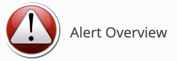

# New Relic Alert Overview

## Usage
Alert Overview is a single New Relic One dashboard to track the current status of alerts in a user intuitive fashion. All alerts, generated and action taken against them across your master and sub-accounts feed into Alert Overview dashboard.

## Pre-requisite
You should have configured webhook to send New Relic Alerts data to Insights. Click [Sending Alerts Data to Insights](https://blog.newrelic.com/product-news/sending-alerts-data-to-insights/) to setup event feed.

## Prerequsite
First, ensure that you have Git and NPM installed. If you're unsure run the following commands to perform verification. If you have them installed these commands will return a version number, if not, the commands won't be recognized.

```
git --version
npm -v
```

## Setup the Development Environment for New Relic One
Follow the instruction outlined in Quick Start section of [developer.newrelic.com](https://developer.newrelic.com/) to setup your environment and when you are ready clone the Alert Overview.

```
nr1 nerdpack:clone -r git@source.datanerd.us:dts/nr1-alerts-overview.git
cd nr1-alerts-overview
```

### Configure the App for your account
Update your New Relic AccountID, Alert event name and the days (how for back chart should show data) in the config.set statement of /nr1-alerts-overview/nerdlets/nr1-alert-overview-nerdlet/index.js  
```
config.set({ accountId: 1234, eventName: 'alert' });
```

### Run below command to start the app 
```
npm install
npm start
```

Visit https://one.newrelic.com/?nerdpacks=local and click  to view the dashboard :sparkles:

## Deploying and Test the App
If you are deploying the app into a different acount than where you have tested. First view the profiles in your development environment and then regenerate a uuid.

```
nr1 profiles:list
nr1 nerdpack:uuid -gf [--profile=your_profile_name]
```

Publish into registry then deploy into your account and enable it for access run following commands.

```
nr1 nerdpack:publish [--profile=your_profile_name]
nr1 nerdpack:deploy [-c [DEV|BETA|STABLE]] [--profile=your_profile_name]
nr1 nerdpack:subscribe [-c [DEV|BETA|STABLE]] [--profile=your_profile_name]
```

Visit https://one.newrelic.com/ to validate the deployment :sparkles: